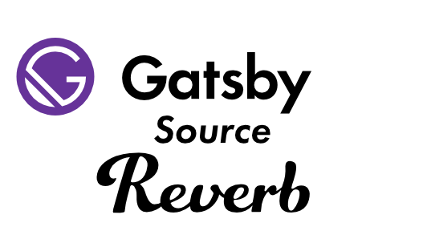

<p align="center">
  
</p>

Source plugin for pulling shop listings into Gatsby from [Reverb].

# Install
```
npm install gatsby-source-reverb
```

# How To Use

First, you need a way to pass environment variables to the build process, so secrets and other secured data aren't committed to source control. We recommend using [`dotenv`][dotenv] which will then expose environment variables. [Read more about dotenv and using environment variables here][envvars]. Then we can _use_ these environment variables and configure our plugin.

```javascript
// In your gatsby-config.js
module.exports = {
  plugins: [
    {
      resolve: `gatsby-source-reverb`,
      options: {
        shopId: `shopId`,
        // Learn about environment variables: https://gatsby.dev/env-vars
        personalAccessToken: process.env.REVERB_PERSONAL_ACCESS_TOKEN,
      },
    },
  ],
}
```

# Configuration Options

**`shopId` [string][required]**

The ID of the Reverb shop.  This can be obtained from the shop URL.  For example, the id for https://reverb.com/shop/owsley-vintage is `owsley-vintage`.

**`personalAccessToken`[string][required]**

A **Personal Access Token** from Reverb.  [Follow this guide to obtain a Personal Access Token](https://www.reverb-api.com/docs/generating-personal-access-tokens). 

We recommended this token be saved as an environment variable named `REVERB_PERSONAL_ACCESS_TOKEN`.

**`verbose`[boolean][optional]**
If present, additional logging for the plugin will be emitted.

# How to query for nodes

***Coming Soon***


[dotenv]: https://github.com/motdotla/dotenv
[envvars]: https://gatsby.dev/env-vars
[Reverb]: https://reverb.com
